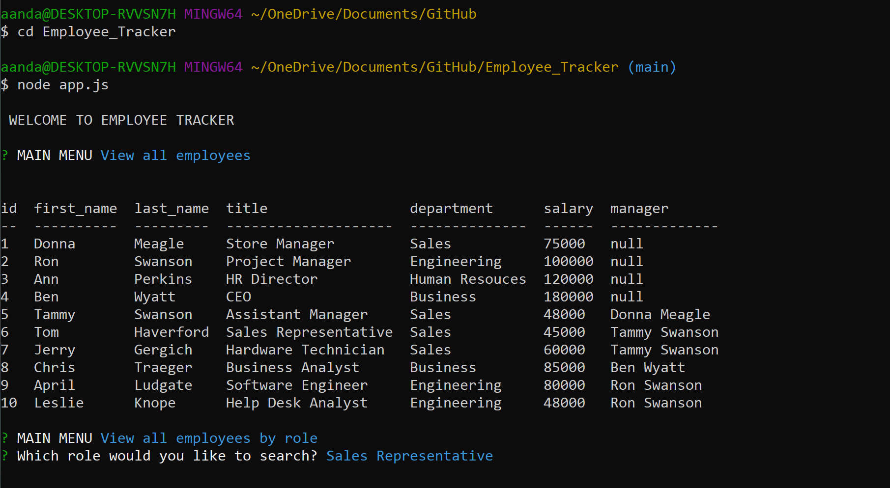

# Employee_Tracker

## Table of Contents
* [Description](#Description)
* [Preview](#Preview)
* [Installation](#Installation)
* [Usage](#Usage)
* [Questions](#Questions)

## Description
This application allows clients to easily manage and keep track of a company's roster. The user will be able to define each department of a company, add employees and their salaries, specify an employee as a manager, as well as several methods to filter employees by.



## Preview


## Installation
1. Clone the repository. 
2. Open the desired terminal. 
3. Navigate to the necessary directory. 
4. Run ``` npm install ```
5. Run ``` npm install inquirer ```

## Usage
1. Run ``` node app.js ```
2. Answer the provided prompts. 

## Questions
Direct any questions, comments, or issues to:

[andal-a] [Email](mailto:aandal77@gmail.com) | [GitHub Profile](https://www.github.com/andal-a)

